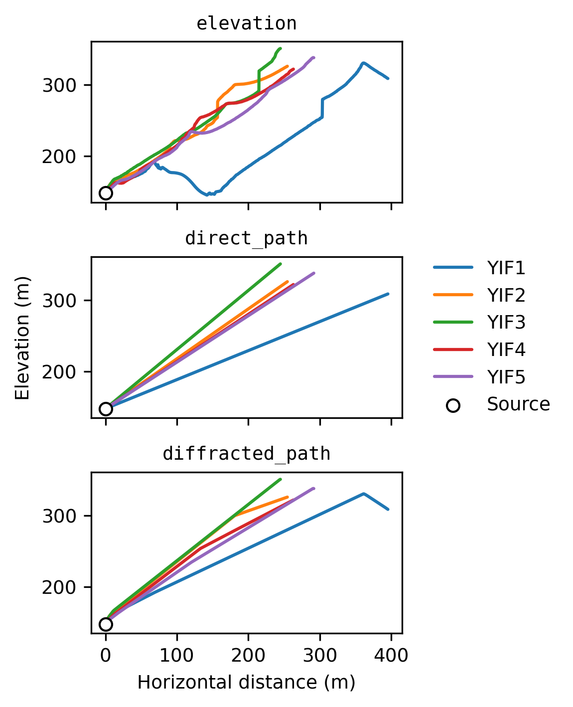

# *infresnel*

*infresnel* is a Python package which facilitates computation of the
[Fresnel number](https://en.wikipedia.org/wiki/Fresnel_number) for
[infrasound](https://en.wikipedia.org/wiki/Infrasound) applications — specifically,
propagation over topography at local to regional scales.

<p align="middle">
  
   &nbsp;&nbsp;&nbsp;&nbsp;&nbsp;&nbsp;&nbsp;&nbsp;&nbsp;&nbsp;&nbsp;&nbsp;
   
</p>

## Background and motivation

The dimensionless Fresnel number $N$ for an acoustic wave with wavelength $\lambda$ is
given by $$N = \frac{(R_\mathrm{f} - R_\mathrm{d})}{\lambda / 2},$$ where $R_\mathrm{f}$
is the length of the shortest diffracted path over topography, and $R_\mathrm{d}$ the
length of the direct path (i.e., line-of-sight slant distance), from source to receiver
(Maher et al., 2021). In words, the Fresnel number is the extra distance a wave must
travel due to topography, normalized by half a wavelength. The path length difference
$(R_\mathrm{f} - R_\mathrm{d})$ can additionally be used to estimate travel time delays
due to diffraction over topography. The travel time delay $\delta_\mathrm{f}$ is given
by $$\delta_\mathrm{f} = \frac{(R_\mathrm{f} - R_\mathrm{d})}{c},$$ where $c$ is the
estimated acoustic wavespeed assuming a homogenous atmosphere. $\delta_\mathrm{f}$ has
been shown to be comparable to travel time differences computed using finite-difference
time-domain simulations — e.g., see
[Fig. 2B](https://www.frontiersin.org/files/Articles/620813/feart-09-620813-HTML-r1/image_m/feart-09-620813-g002.jpg)
in Fee et al. (2021).

These are simple equations, but the practical computation of the quantity
$(R_\mathrm{f} - R_\mathrm{d})$ is somewhat involved. The goal of *infresnel* is to make
this computation as quick and convenient as possible.

## Quickstart

1. Obtain
   ```
   git clone https://github.com/liamtoney/infresnel.git
   cd infresnel
   ```

2. Create environment, install, and activate
   ```
   conda env create
   conda activate infresnel
   ```

3. Run using the Python interpreter
   ```python
   python
   >>> from infresnel import calculate_paths
   ```

## Usage

🚧 **Detailed documentation is forthcoming!** For now, check out
[`example_yasur.py`](example_yasur.py).

## Installation details

*infresnel*'s dependencies are [PyGMT](https://www.pygmt.org/latest/) (for simplified
SRTM data downloading and caching) and
[rioxarray](https://corteva.github.io/rioxarray/stable/) (for DEM file I/O,
reprojection, and elevation profile interpolation). These dependencies are listed in
[`environment.yml`](environment.yml), and they are installed in step 2 above. Note that
[Matplotlib](https://matplotlib.org/) is an optional dependency; it's used only for
plotting.

You might want to install *infresnel* into an existing
[conda](https://docs.conda.io/en/latest/) environment, instead of making a new one. In
this case, after step 1 above run
```
conda activate <existing_environment>
pip install --editable .
```
which uses [pip](https://pip.pypa.io/en/stable/) to install *infresnel*'s dependencies,
if you don't already have them installed in your existing environment.

In either case, your installation will be "editable." This means that you can modify the
source code in your local `infresnel/` directory — or run a `git pull` to update with
any new remote changes — and the installed package will be updated.

## References

Fee, D., Toney, L., Kim, K., Sanderson, R. W., Iezzi, A. M., Matoza, R. S., De Angelis,
S., Jolly, A. D., Lyons, J. J., & Haney, M. (2021). Local explosion detection and
infrasound localization by reverse time migration using 3-D finite-difference wave
propagation. *Frontiers in Earth Science*, *9*.
https://doi.org/10.3389/feart.2021.620813

Maher, S. P., Matoza, R. S., de Groot-Hedlin, C., Kim, K., & Gee, K. L. (2021).
Evaluating the applicability of a screen diffraction approximation to local volcano
infrasound. *Volcanica*, *4*(1), 67–85. https://doi.org/10.30909/vol.04.01.6785
