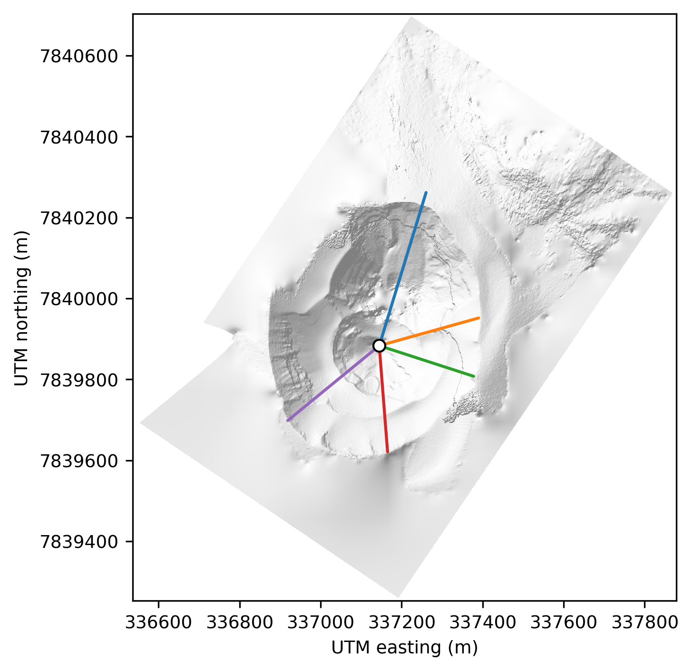
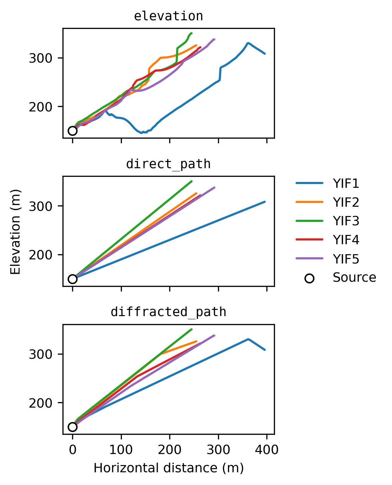

# *infresnel*

[](https://infresnel.readthedocs.io/en/latest/?badge=latest) [](https://github.com/liamtoney/infresnel/actions/workflows/build.yml) [](https://github.com/psf/black) [](https://pycqa.github.io/isort/) [](https://mybinder.org/v2/gh/liamtoney/infresnel/HEAD)  
[](https://doi.org/10.5281/zenodo.7388645) 

*infresnel* is a Python package which facilitates computation of the
[Fresnel number](https://en.wikipedia.org/wiki/Fresnel_number) for
[infrasound](https://en.wikipedia.org/wiki/Infrasound) applications — specifically,
propagation over topography at local to regional scales.

<p align="middle">
  
  
</p>

## Background and motivation

The dimensionless Fresnel number $N$ for an acoustic wave with wavelength $\lambda$ is
given by $$N = \frac{(R_\mathrm{f} - R_\mathrm{d})}{\lambda / 2},$$ where $R_\mathrm{f}$
is the length of the shortest diffracted path over topography, and $R_\mathrm{d}$ the
length of the direct path (i.e., line-of-sight slant distance), from source to receiver
(Maher et al., 2021). In words, the Fresnel number is the extra distance a wave must
travel due to topography, normalized by half a wavelength. The path length difference
$(R_\mathrm{f} - R_\mathrm{d})$ can additionally be used to estimate travel time delays
due to diffraction over topography. The travel time delay $\delta_\mathrm{f}$ is given
by $$\delta_\mathrm{f} = \frac{(R_\mathrm{f} - R_\mathrm{d})}{c},$$ where $c$ is the
estimated acoustic wavespeed assuming a homogenous atmosphere. $\delta_\mathrm{f}$ has
been shown to be comparable to travel time differences computed using finite-difference
time-domain simulations — e.g., see
[Fig. 2B](https://www.frontiersin.org/files/Articles/620813/feart-09-620813-HTML-r1/image_m/feart-09-620813-g002.jpg)
in Fee et al. (2021).

$N$ can be used to estimate the loss of infrasound energy due to diffraction over
topography — the "insertion loss" — via application of empirical scaling relationships.
See Maher et al. (2021) for a thorough discussion of these various empirical
relationships, and their limitations, in the context of volcano infrasound.

These are simple equations, but the practical computation of the quantity
$(R_\mathrm{f} - R_\mathrm{d})$ is somewhat involved. The goal of *infresnel* is to make
this computation as quick and convenient as possible.

## Quickstart

1. Obtain
   ```
   git clone https://github.com/liamtoney/infresnel.git
   cd infresnel
   ```

2. Create environment, install, and activate
   ([install conda](https://conda.io/projects/conda/en/latest/user-guide/install/index.html)
   first, if necessary)
   ```
   conda env create
   conda activate infresnel
   ```

3. Run using the Python interpreter
   ```python
   python
   >>> from infresnel import calculate_paths
   ```

## Usage

Interactive API reference documentation for *infresnel* can be found
[here](https://infresnel.rtfd.io/).

Additionally, several interactive notebooks containing usage examples are
included in [`notebooks`](notebooks). To open the notebooks, with your conda
environment activated run
```
jupyter lab notebooks
```
Alternatively, you can run these notebooks in your browser — without installing
*infresnel* — by navigating to the project's
[Binder](https://mybinder.org/v2/gh/liamtoney/infresnel/HEAD).

## Assumptions

*infresnel* calculates path length differences using elevation profiles. This means that
**all diffraction is assumed to take place in the vertical plane between source and
receiver.** One can easily construct scenarios where this assumption is violated. For
example, consider a column of rock much taller than it is wide, located directly between
source and receiver. For this scenario, *infresnel* would predict a large path length
difference for waves traveling over the top of the column — but in reality, wavefronts
diffract laterally around the column. The true travel time from source to receiver is
thus much smaller than what *infresnel* predicts for this scenario.

## Citing

If you use *infresnel* in research that leads to a published manuscript, please
cite the tool:
> Toney, L. (2024). *infresnel* (v0.3.0). Zenodo. https://doi.org/10.5281/zenodo.11176356

To cite a previous version of *infresnel*, go to the
[Zenodo page](https://doi.org/10.5281/zenodo.7388645), select the version, and use the
"Cite as" tool there.

## Installation details

*infresnel*'s dependencies are:

* [colorcet](https://colorcet.holoviz.org/) (for perceptually accurate colormaps to use
  in the creation of GeoTIFF path length difference grids)
* [ipympl](https://matplotlib.org/ipympl/)
* [ipywidgets](https://ipywidgets.readthedocs.io/en/stable/)
* [joblib](https://joblib.readthedocs.io/en/stable/) (for parallel processing)
* [JupyterLab](https://jupyterlab.readthedocs.io/en/latest/) (for running the
  interactive `.ipynb` notebooks)
* [Matplotlib](https://matplotlib.org/) (for applying colormaps to GeoTIFFs and for
  generally plotting results)
* [Numba](https://numba.pydata.org/) (for computational acceleration)
* [pip](https://pypi.org/project/pip/)
* [PyGMT](https://www.pygmt.org/latest/) (for simplified SRTM data downloading and
  caching)
* [rioxarray](https://corteva.github.io/rioxarray/stable/) (for DEM file I/O,
  reprojection, and elevation profile interpolation)
* [tqdm](https://tqdm.github.io/) (for displaying progress bars)

These dependencies are listed in [`environment.yml`](environment.yml), and they are
installed in step 2 above.

You might want to install *infresnel* into an existing conda environment, instead of
making a new one. In this case, after step 1 above run
```
conda activate <existing_environment>
pip install --editable .
```
which uses pip to install *infresnel*'s dependencies, if you don't already have them
installed in your existing environment.

In either case, your installation will be "editable." This means that you can modify the
source code in your local `infresnel` directory — or run a `git pull` to update with
any new remote changes — and the installed package will be updated. To instead use a
[specific release](https://github.com/liamtoney/infresnel/releases) of *infresnel*, run
```
git switch -d vX.Y.Z
```
between steps 1 and 2, where `vX.Y.Z` is the release version (e.g., `v0.1.0`). You can
switch back with `git switch main`.

## Contributing

If you notice a bug with *infresnel* (or if you'd like to request/propose a new
feature), please
[create an issue on GitHub](https://github.com/liamtoney/infresnel/issues/new)
(preferred) or email me at [`liam@liam.earth`](mailto:liam@liam.earth). You are also
welcome to create a
[pull request](https://docs.github.com/en/pull-requests/collaborating-with-pull-requests/proposing-changes-to-your-work-with-pull-requests/about-pull-requests).

To install *infresnel*'s development packages, with your conda environment
activated run
```
pip install --requirement requirements.txt
nbdime config-git --enable  # Configure Jupyter Notebook diffs
```

## References

Fee, D., Toney, L., Kim, K., Sanderson, R. W., Iezzi, A. M., Matoza, R. S., De Angelis,
S., Jolly, A. D., Lyons, J. J., & Haney, M. (2021). Local explosion detection and
infrasound localization by reverse time migration using 3-D finite-difference wave
propagation. *Frontiers in Earth Science*, *9*.
https://doi.org/10.3389/feart.2021.620813

Maher, S. P., Matoza, R. S., de Groot-Hedlin, C., Kim, K., & Gee, K. L. (2021).
Evaluating the applicability of a screen diffraction approximation to local volcano
infrasound. *Volcanica*, *4*(1), 67–85. https://doi.org/10.30909/vol.04.01.6785

## Acknowledgements

This work was supported by the Nuclear Arms Control Technology (NACT) program at the
Defense Threat Reduction Agency (DTRA). Cleared for release.
